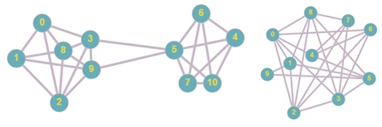
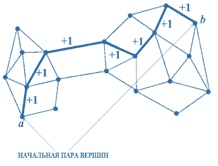
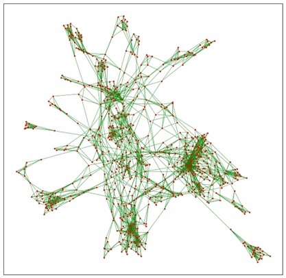
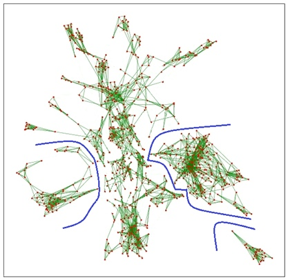
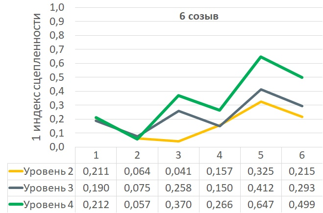
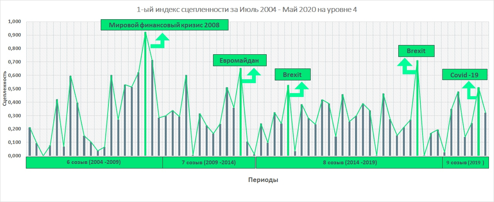

**Анализ сложных социально-экономических систем с использованием индексов сцепленности графа (Малынковский О.В.)**

Научный руководитель: Рубчинский А.А., доц., к.т.н.

**Введение**

При моделировании и анализе сложных систем усилия исследователей часто направляются на построение их разумных декомпозиций. Однако во многих случаях единственно верных разбиений систем на группы просто нет, что обусловлено объективными причинами. Примером таких систем являются голосующие органы, фондовые рынки …

В связи с этим, отдельные полученные разбиения не представляют интереса. Можно лишь построить многочисленные декомпозиции, каждая из которых будет имеет некоторый смысл, но не будет иметь особых преимуществ перед другими. Целесообразней сконцентрировать внимание на вычислении специальных показателей, основанных на указанных семействах, которые позволять делать выводы о внутреннем устройстве системы.

**Переходим к содержательной постановке задачи:**

Необходимо смоделировать сложную систему с помощью графа. В качестве такой системы возьмем голосующий орган – Европарламент. Так как отдельные разбиение интереса не представляют, то нужно построить семейство таких разбиение и анализировать их уже в целом. Разбиение будем производить с помощью описанного выше ЧАР. После этого необходимо рассчитать индексы сцепленности графа, с помощью которых будет возможен дальнейший анализ исследуемой системы. Упомянутые индексы сцепленности могут иметь различные содержательные интерпретации, но, в общем случае, они описывают сложность, запутанность, неясность, неопределенность и другие трудно формализуемые, хотя и весьма важные свойства разнообразных систем.

**Про ЧАР:**

Научным руководителем предложен алгоритм, с помощью которого можно будет построить семейство декомпозиций графа – частотный алгоритм разбиений (ЧАР). Основная идея алгоритма (он итеративный, также необходимо априорное задание числа выделяемых групп): задать изначально частоты всем ребрам случайным образом; между двумя случайно выбранными вершинами найти кратчайший путь модифицированным алгоритмом Дейкстры и произвести модификацию частот, если путь не содержит ребро с максимальной частотой, иначе производим разбиение «отбрасывая» ребра с максимальной частотой.

Этот момент обговорим подробнее, так как в этом случае может получиться разное число групп. Если число группы меньше необходимого, то возвращаемся к модификации частот, а если больше нужного, то есть разные подходы к объединению мелких сообществ в более крупные, чтобы вышло нужное число групп. Затем запоминаем получившиеся разбиение. Повторяем M раз.

**Построение графа голосований:**

В качестве системы, исследуемой с применением индексов сцепленности, выбран Европарламент.

На основании исходной таблицы каждому *i*-му депутат (*i* = 1, 2, …, *m*) был сопоставлен вектор 
$$
v_i = (v_1^i, v_2^i, …, v_n^i)
$$
  , где *n* – число голосований в данном месяце. Положим

$$
1,если\ i-ый\ депутат\ голосовал\ за\ j-ое\ предложение;\\  v_j^i  = \{\     -1,если\ i-ый\ депутат\ голосовал\ против\ j-го\ предложения;\\0,в\ противном\ случае\ (воздержался\ или\ не\ участвовал)
$$
Несходство *dst* между *s*-ым и *t*-ым депутатами определяется как обычное евклидово расстояние между векторами *v_s* и *v_t* .
$$
d_st=√(∑_{i=1}^n((v_s)_i-(v_t)_i )^2
$$
По матрице несхожести *D* = (*dst*) граф голосований *G* определяется как граф соседства. Вершины графа соответствуют депутатам, рёбра указывают на относительную близость позиций депутатов. Каждый депутат соединяется ребром с 4-мя ближайшими (по расстояниям из матрицы *D*). В случае, если окажется несколько депутатов с таким же расстоянием из D, то на графе их также соединяем ребрами. Полученный граф является *графом голосований*.

**Математическая постановка задачи:**

Зададим неориентированный простой граф *G,* где *G* — это упорядоченная пара *G:=(V,E),* где *V*—множество вершин, а *E* — множество рёбрами.

Применим ЧАР к этому графу. Для каждого значения параметра *M* результатом работы описанного алгоритма будет семейство разбиений множества вершин исходного графа на k частей. Некоторые из них могут совпадать, а некоторые – быть различными.

Семейство всех разбиений состоит из *M* элементов: . Пусть среди *M* разбиений разбиение *dp* встречается *mp* раз (*p* = 1, …, *t**,* где *t* *–* количество разбиений), где . Числа *mp* (*p* = 1, …, *t*) подсчитываются непосредственно по семейству *M* разбиений, найденных ЧАД с помощью сравнения двух разбиений. С их помощью рассчитываем 1-ый индексом сцепленности рассматриваемого графа: 

Пусть среди *M* дихотомий встречается всего *D* различных. Рассчитываем 2-ой индекс сцепленности графа:

С помощью вычисленных значений оцениваются сложность, запутанность, неясность, неопределенность и другие трудно формализуемые, хотя и весьма важные свойства разнообразных систем.

**Выбор средств для решения задачи:**

Для решения поставленной задачи требуется программное обеспечение для получения исходных данных, а также осуществляющее ЧАР и вычисляющее значения индексов сцепленнности. В качестве языка программирования был выбран Python. Для произведения расчетов будет использована облачная среда Google Colaboratory. Модуль json, pandas для получения входных данных,  numpy для получения матриц смежности из входных значений, а для работы с графами использована библиотека Networkx и matplotlib для их визуализации.

**Исходные данные:**

Отдельным этапом является подготовка исходных данных. Данные по Европарламенту предоставляются в формате json. В связи с иным оформлением и структурированием, оттуда были извлечены только нужные данные и переведены в нужный вид. На слайде представлен фрагмент одной из такой таблиц, которых в общем счета 86 штук.

|              | 0060/2014 | 0083/2014 | 0093/2014 | 0070/2014 | 0080/2014 | 0168/2014 | 0025/2014 |
| ------------ | --------- | --------- | --------- | --------- | --------- | --------- | --------- |
| van Baalen   | 1         | 1         | 1         | 1         | 1         | 1         | 1         |
| Austrevicius | 1         | 1         | 1         | 1         | 1         | 1         | 1         |
| Barekov      | 1         | 1         | 1         | 1         | 1         | 1         | -1        |
| Iwaszkiewicz | -1        | -1        | -1        | -1        | -1        | 1         | -1        |
| Atkinson     | 0         | -1        | -1        | 0         | 1         | -1        | 1         |

**Получение разбиения графа:**

Соответствующее ПО уже написано и можно обработать все периоды. На картинке слева можно увидеть, что из себя представляет получаемый граф голосований, какая запутанная у него структура. Красные точки – депутаты, зеленые дугу соединяют близких по взглядам членов Европарламента. (Справа пример того, что получится после ЧАР – несколько компонент связности, которые мы будем запоминать для последующих расчетов сцепленности).

**Результаты расчетов:**

Были произведены расчеты двух индексов сцепленности графов голосований Европарламента на уровнях (то есть деление на группы) 2,3,4. Число итераций в каждом случае составило 2000 раз.

Между двумя индексами была вычислена корреляциях на 2,3,4 уровнях. Можно сделать вывод о том, что в целом можно пользоваться и тем, и тем индексами, так как их значения коррелируют с высокой степенью. Однако преимущество первого индекса, рассчитываемого через энтропию разбиений графа, состоит в том, что он учитывает количество каждого разбиения во всей выборке, тогда как второй индекс даст одинаковые значения , если например будет 2 уникальных разбиение и одно встретится один раз, а другое 1999 раз, и если бы одно встретилось 400 раз, а другое 1600.

На рисунке приведен график усредненных по месяцам значений 1-го индекса сцепленности на уровнях 2, 3, 4 для 6-го созыва Европарламента. Его форма кардинально отлична от нашей Думы , по крайней мере 2, 3, 4 созывов (данные по которой изучены в рамках литературного обзора)

|             | **Уровень 2** | **Уровень 3** | **Уровень 4** |
| ----------- | ------------- | ------------- | ------------- |
| **6 созыв** | 0,169         | 0,230         | 0,342         |
| **7 созыв** | 0,082         | 0,241         | 0,285         |
| **8 созыв** | 0,050         | 0,176         | 0,260         |
| **9 созыв** | 0,104         | 0,328         | 0,333         |

Если сравнивать средние значения за все время работы одного созыва с остальными составами, то нет какого-то явного тренда спада или роста. Однако при сравнении по уровням, наблюдается рост при увеличении числа групп, на которые делился граф при построении семейства разбиений. Почти идеально происходит деление на две части, а на большее число уже хуже. Хотя число партий вообще 8, вероятно их трудно объединить по взгляд в 3 или 4 группы. 

Согласно определению сцепленности именно малые значения близкие к нулю говорят о внутренней упорядоченности, согласованности в работе, а чем выше индексы, тем все хаотичнее. Значения в целом выше, чем у Думы. Попробуем найти этому объяснение. 

**Анализ результатов**

Здесь для наглядность возьмем только деление на 4 группы и воспользуемся первым индексов. На графике показан вообще весь период , по которому есть данные : с 2004 по 2020

Попробуем связать период пиковых значений с событиями, тогда происходившими. И действительно в пиковые моменты имели место резонансные ситуации : кризис 2008, Евромайдан на Украине, Brexit, пандемия вируса Covid-19 совсем вот недавно…  Яркий отклик в 2008 самый интересный, так как кризис финансовый, а Европарламент в первую очередь политическая структура.

**Выводы:**

Было исследовано понятие и способы вычисления сцепленности графа, составлен литературный обзор. Выбраны средства для разработки ПО. Исходные данные были получены и рассчитаны индексы сцепленности. Впоследствии рассчитаны индексы сцепленности для всего периода. Предложенное понятие сцепленности оказалось полезным при анализе согласованности работы голосующих органов Европарламента.  С помощью описанных процедур действительно получилось смоделировать динамику структурных изменений работы системы во времени. 

Текст работы был опубликован в сборнике «75-е Дни науки в МИСиС». Работа стала призером в конкурсе проектных работ имени академика Бочвара.
